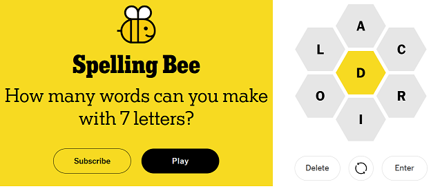

Below is a super simple Spelling Bee solver:

``` r
library(tidyverse)

#read in most common 100k+ words
words <- readLines("https://www.gutenberg.org/files/3201/files/CROSSWD.TXT")

tibble(word = words, length = str_length(words)) %>%   #add word length
    filter(length >= 4) %>%                            #filter words 4 characters or more
    filter(str_detect(word, "^[ioralcd]+$")) %>%       #filter words with character set
    filter(str_detect(word, "d")) %>%                  #filter words with middle character
    arrange(desc(length)) %>%                          #arrange by largest words
    view()
```

<br /> <br /> <br /> <br /> <br />
