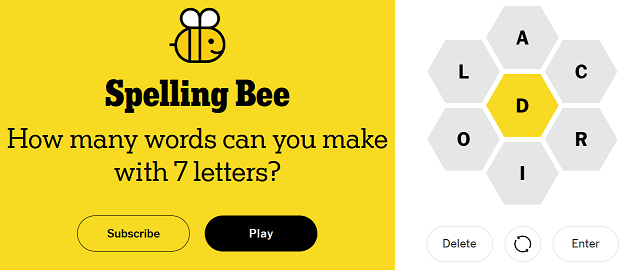

```{r setup, include=FALSE}
knitr::opts_chunk$set(echo = TRUE)
```




Below is a super simple Spelling Bee solver:

```{r, message=FALSE, error=FALSE}
library(tidyverse)

#read in 100k+ words from the Official Scrabble Players Dictionary
words <- readLines("https://www.gutenberg.org/files/3201/files/CROSSWD.TXT")

tibble(word = words, length = str_length(words)) %>%   #add word length
    filter(length >= 4) %>%                            #filter words 4 characters or more
    filter(str_detect(word, "^[ioralcd]+$")) %>%       #filter words with character set
    filter(str_detect(word, "d")) %>%                  #filter words with middle character
    arrange(desc(length)) %>%                          #arrange by largest words
    view()
```


```{r, echo = FALSE}
# library(rmarkdown)
# render("nyt_spelling_bee_solver.Rmd", output_file = "README.md", md_document(variant = "markdown_github"))
```

<br />
<br />
<br />
<br />
<br />